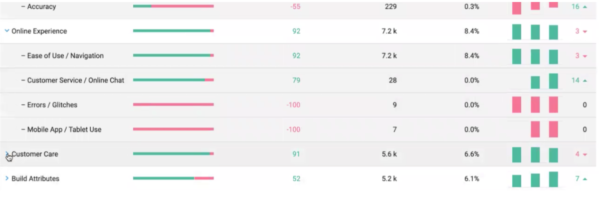
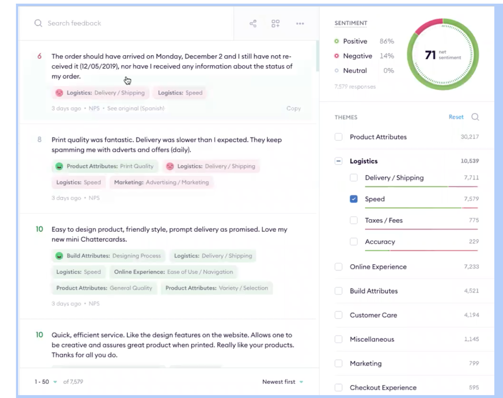

# Backend Engineer Interview

## We are given with the data to power following views

1.  ### Pulse

    The first page is a collection of topics (ex: Online Experience). The topics are composed of different themes (ex: Ease of Use/Navigation). As shown in the images below, each topic has some metadata associated with it like sentiment, num of mentions etc.
    

    On clicking a topic, a list of themes inside that topic opens up. Themes have the same metadata as the topic. On clicking the topic, the topic analysis page opens up.

    

2.  ### Topic Analysis

    There are 4 panes in this view.

    1.  Feedback Viewer: Each feedback has the following attributes:
        1. Text
        2. List of Topics + Themes
        3. Score (6,8,10,10) etc
        4. Date
    2.  Net Sentiment Score: For the selected theme, calculate the net sentiment (pos sentiment - neg sentiment). Show the number of responses filtered as well.
    3.  Theme Selector:
        1. Checkboxes to select different themes. Selecting a topic, selects all themes in it. ( i.e query data for one or more themes or topics )
        2. A search button to find topics/themes.
        4. Against each theme/topic show #mentions and sentiment bar.
    4.  Pagination and sorting:
        1. Paginate across the feedbacks
        2. Sort by date, highest sentiment, lowest sentiment etc.

    

# You are tasked with creating a CLI that supports similar access-patterns as shown in the above UI

### Evaluation Criteria

1.  Features implemented
2.  Low Level Design & Data Modeling [ Extensibility, Loose-Coupling etc ]
3.  Robustness of code - patterns used/tests/comments etc 
4.  Efficiency of Code - how it scales with more data 

### Things to note

1.  Push your code in this repo. Work like how you would work in a real life setting, breaking things into commits, adding tests, proper low level design etc.
2.  We’ve intentionally left quite a few things vague and ambiguous to replicate the real environment.
3.  We’d recommend using golang but it's your choice.
4.  Put your code in the folder `src`.
5.  Feel free to leave stubs at few places in case you're short on time.
6.  Sample data is present in `data`. Do note: in the sample data, there is a 1:1 mapping between theme and topic. Please keep your implementation independent from this fact. A topic can have multiple themes in it.
7. This is more of a LLD assignment. On the call, we will go over HLD of this.

PS: provided data has same value for the `theme` and `topic`, pls don't get confused by it, topic and theme can have separate values

